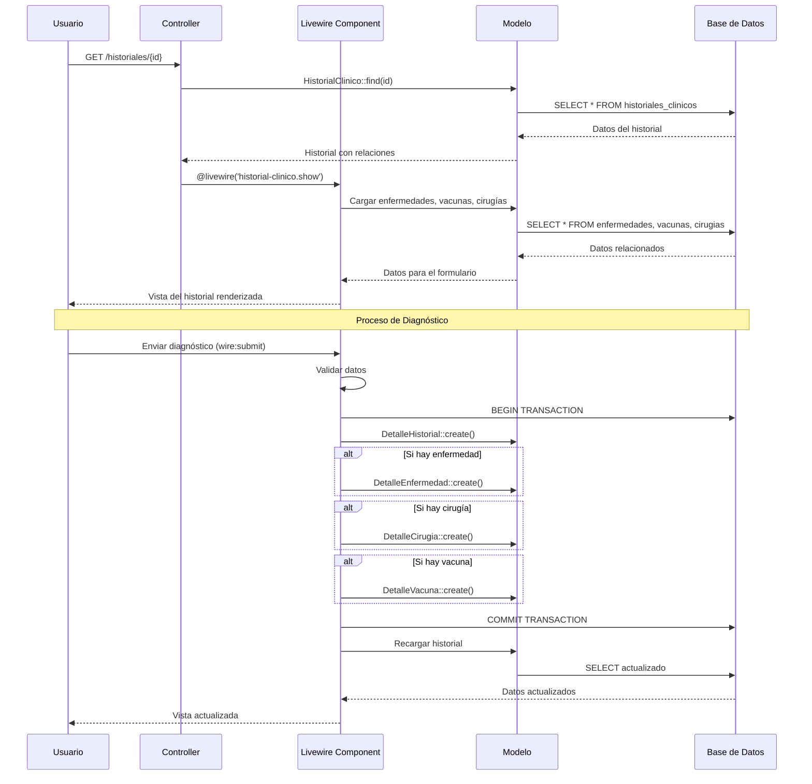
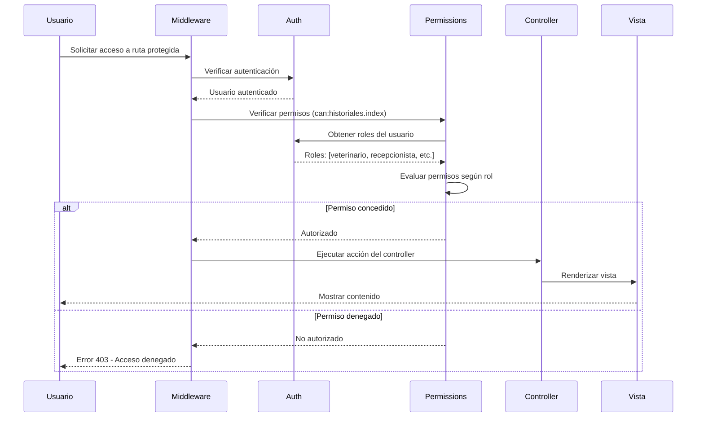
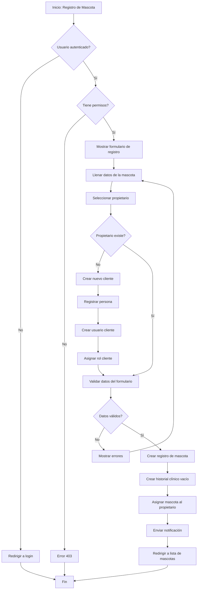
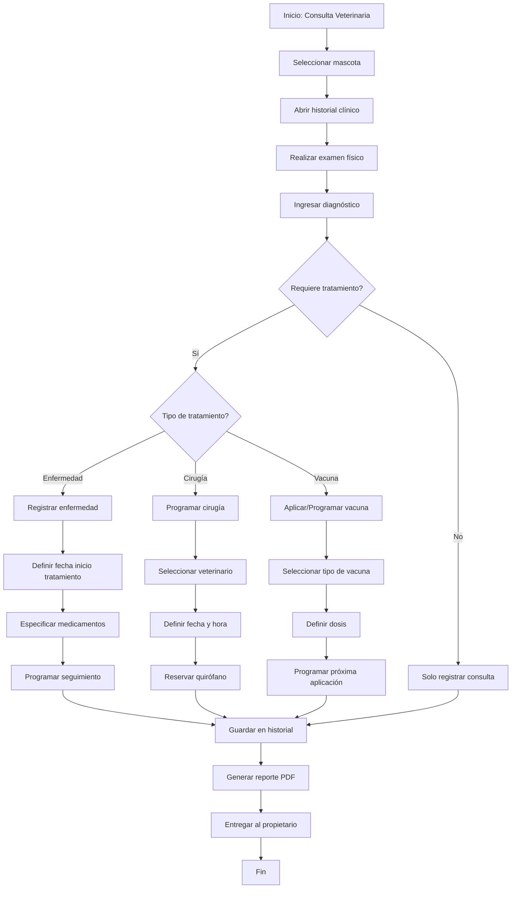

# 🐾 Sistema de Gestión Veterinaria "Only Pets"

> Sistema integral de gestión para clínicas veterinarias desarrollado en Laravel 10 con Livewire 3

## 📋 Descripción del Proyecto

**Only Pets** es un sistema completo de gestión veterinaria que permite administrar de manera eficiente:

- 👥 **Gestión de Usuarios**: Administración de roles (veterinarios, recepcionistas, clientes, supervisores)
- 🐕 **Gestión de Mascotas**: Registro y seguimiento de animales
- 📋 **Historiales Clínicos**: Seguimiento médico completo
- 💊 **Control de Vacunas**: Programación y seguimiento de vacunación
- 🔬 **Gestión de Enfermedades**: Diagnóstico y tratamiento
- ⚕️ **Cirugías**: Programación y registro de procedimientos
- 💰 **Sistema de Ventas**: Gestión de productos y servicios
- 📊 **Reportes PDF**: Generación de documentos clínicos

## 🚀 Tecnologías Utilizadas

- **Backend**: Laravel 10.x
- **Frontend**: Livewire 3.x, Bootstrap 5, Alpine.js
- **Base de Datos**: MySQL/PostgreSQL/SQLite
- **Autenticación**: Laravel Breeze + Spatie Permissions
- **PDF**: DomPDF
- **Estilos**: CSS3 + Bootstrap 5

## 📊 Diagramas del Sistema

### 🔄 Diagrama de Secuencia - Gestión de Historial Clínico



### 🔄 Diagrama de Secuencia - Sistema de Autenticación y Permisos



### 📋 Diagrama de Actividades - Proceso de Registro de Mascota



### 📋 Diagrama de Actividades - Proceso de Diagnóstico Veterinario



### 🏗️ Diagrama de Clases - Modelo de Datos Principal

```mermaid
classDiagram
    class User {
        +id: int
        +name: string
        +email: string
        +email_verified_at: timestamp
        +password: string
        +id_persona: int
        +created_at: timestamp
        +updated_at: timestamp
        +persona()
        +hasRole(role)
        +can(permission)
    }

    class Persona {
        +id: int
        +nombre: string
        +apellido_paterno: string
        +apellido_materno: string
        +ci: string
        +telefono: string
        +direccion: string
        +fecha_nacimiento: date
        +created_at: timestamp
        +updated_at: timestamp
        +user()
        +cliente()
        +veterinario()
    }

    class Cliente {
        +id: int
        +id_persona: int
        +created_at: timestamp
        +updated_at: timestamp
        +persona()
        +mascotas()
    }

    class Veterinario {
        +id: int
        +id_persona: int
        +especialidad: string
        +created_at: timestamp
        +updated_at: timestamp
        +persona()
        +cirugias()
    }

    class Mascota {
        +id: int
        +nombre: string
        +raza: string
        +descripcion: text
        +fecha_nacimiento: date
        +id_cliente: int
        +created_at: timestamp
        +updated_at: timestamp
        +cliente()
        +historialClinico()
    }

    class HistorialClinico {
        +id: int
        +id_mascota: int
        +peso: decimal
        +talla: decimal
        +created_at: timestamp
        +updated_at: timestamp
        +mascota()
        +detalleHistorial()
        +cirugias()
        +vacunas()
        +enfermedades()
    }

    class DetalleHistorial {
        +id: int
        +descripcion: text
        +fecha_consulta: date
        +fecha_prox_consulta: date
        +id_historial: int
        +created_at: timestamp
        +updated_at: timestamp
        +historial()
    }

    class Enfermedad {
        +id: int
        +nombre: string
        +tipo: string
        +created_at: timestamp
        +updated_at: timestamp
        +historiales()
    }

    class DetalleEnfermedad {
        +id: int
        +id_enfermedad: int
        +id_historial: int
        +fecha_deteccion: date
        +inicio_tratamiento: date
        +fin_tratamiento: date
        +created_at: timestamp
        +updated_at: timestamp
    }

    class Vacuna {
        +id: int
        +nombre: string
        +created_at: timestamp
        +updated_at: timestamp
        +historiales()
    }

    class DetalleVacuna {
        +id: int
        +id_vacuna: int
        +id_historial: int
        +dosis: int
        +fecha_aplicacion: date
        +fecha_prox_aplicacion: date
        +created_at: timestamp
        +updated_at: timestamp
    }

    class Cirugia {
        +id: int
        +nombre: string
        +tipo: string
        +created_at: timestamp
        +updated_at: timestamp
        +historiales()
    }

    class DetalleCirugia {
        +id: int
        +id_cirugia: int
        +id_historial: int
        +fecha: date
        +hora: time
        +veterinario_encargado: string
        +created_at: timestamp
        +updated_at: timestamp
    }

    %% Relaciones
    User ||--|| Persona : "tiene"
    Persona ||--o| Cliente : "puede_ser"
    Persona ||--o| Veterinario : "puede_ser"
    Cliente ||--o{ Mascota : "posee"
    Mascota ||--|| HistorialClinico : "tiene"
    HistorialClinico ||--o{ DetalleHistorial : "contiene"
    HistorialClinico ||--o{ Enfermedad : "padece"
    HistorialClinico ||--o{ Vacuna : "recibe"
    HistorialClinico ||--o{ Cirugia : "requiere"
    Enfermedad ||--o{ DetalleEnfermedad : "detalle"
    Vacuna ||--o{ DetalleVacuna : "detalle"
    Cirugia ||--o{ DetalleCirugia : "detalle"
```

### 🏗️ Diagrama de Clases - Sistema de Roles y Permisos

```mermaid
classDiagram
    class Role {
        +id: int
        +name: string
        +guard_name: string
        +created_at: timestamp
        +updated_at: timestamp
        +permissions()
        +users()
    }

    class Permission {
        +id: int
        +name: string
        +guard_name: string
        +created_at: timestamp
        +updated_at: timestamp
        +roles()
    }

    class ModelHasRoles {
        +role_id: int
        +model_type: string
        +model_id: int
    }

    class RoleHasPermissions {
        +permission_id: int
        +role_id: int
    }

    %% Relaciones del sistema de permisos
    User ||--o{ Role : "tiene"
    Role ||--o{ Permission : "otorga"
    Role ||--o{ ModelHasRoles : "through"
    Permission ||--o{ RoleHasPermissions : "through"
    
    note for Role "Roles: super-admin, recepcionista,<br/>veterinario, cliente, supervisor"
    note for Permission "Permisos: usuarios.index, usuarios.create,<br/>mascotas.index, historiales.edit, etc."
```

## 🔧 Instalación y Configuración

### Prerrequisitos

- PHP 8.1 o superior
- Composer
- Node.js y NPM
- MySQL/PostgreSQL/SQLite

### Pasos de Instalación

1. **Clonar el repositorio**
```bash
git clone [url-del-repositorio]
cd Proyecto_SI1-Veterinaria-Only-Pets
```

2. **Instalar dependencias de PHP**
```bash
composer install
```

3. **Configurar variables de entorno**
```bash
cp .env.example .env
# Editar .env con tus configuraciones de base de datos
```

4. **Generar clave de aplicación**
```bash
php artisan key:generate
```

5. **Ejecutar migraciones y seeders**
```bash
php artisan migrate:fresh --seed
```

6. **Crear enlace simbólico para storage**
```bash
php artisan storage:link
```

7. **Limpiar cachés**
```bash
php artisan config:clear
php artisan cache:clear
php artisan view:clear
```

8. **Iniciar servidor de desarrollo**
```bash
php artisan serve
```

## 📁 Estructura del Proyecto

```
├── app/
│   ├── Http/
│   │   ├── Controllers/          # Controladores
│   │   ├── Middleware/           # Middleware personalizado
│   │   └── Kernel.php
│   ├── Livewire/                 # Componentes Livewire 3
│   │   └── HistorialClinico/
│   ├── Models/                   # Modelos Eloquent
│   ├── Providers/                # Service Providers
│   └── View/Components/          # Componentes Blade
├── database/
│   ├── migrations/               # Migraciones de BD
│   └── seeders/                  # Seeders
├── resources/
│   ├── views/                    # Vistas Blade
│   │   ├── livewire/            # Vistas de Livewire
│   │   └── components/          # Componentes Blade
│   └── css/                     # Estilos CSS
└── routes/
    ├── web.php                  # Rutas web
    └── api.php                  # Rutas API
```

## 👥 Roles y Permisos

### Roles del Sistema

- **🔴 Super Admin**: Acceso completo al sistema
- **👩‍⚕️ Veterinario**: Gestión de historiales, diagnósticos, cirugías
- **👩‍💼 Recepcionista**: Gestión de citas, usuarios, mascotas básico
- **📋 Supervisor**: Supervisión y reportes
- **👤 Cliente**: Ver sus mascotas e historiales

### Matriz de Permisos

| Funcionalidad | Super Admin | Veterinario | Recepcionista | Supervisor | Cliente |
|---------------|-------------|-------------|---------------|------------|---------|
| Gestión Usuarios | ✅ | ❌ | ✅ | ✅ | ❌ |
| Gestión Mascotas | ✅ | ✅ | ✅ | ✅ | 👁️ |
| Historiales Clínicos | ✅ | ✅ | 👁️ | ✅ | 👁️ |
| Diagnósticos | ✅ | ✅ | ❌ | ❌ | ❌ |
| Cirugías | ✅ | ✅ | ❌ | ✅ | 👁️ |
| Vacunas | ✅ | ✅ | ✅ | ✅ | 👁️ |
| Reportes PDF | ✅ | ✅ | ✅ | ✅ | ✅ |

*👁️ = Solo lectura, ✅ = Acceso completo, ❌ = Sin acceso*

## 🔌 API Endpoints

### Autenticación
- `POST /login` - Iniciar sesión
- `POST /logout` - Cerrar sesión
- `POST /register` - Registro (si está habilitado)

### Recursos Principales
- `GET|POST /usuarios` - Gestión de usuarios
- `GET|POST /mascotas` - Gestión de mascotas
- `GET|POST /historiales` - Historiales clínicos
- `GET|POST /vacunas` - Gestión de vacunas
- `GET|POST /enfermedades` - Gestión de enfermedades
- `GET|POST /cirugias` - Gestión de cirugías

### Reportes
- `GET /historiales/{id}/pdf` - Generar PDF del historial

## 🧪 Testing

```bash
# Ejecutar tests
php artisan test

# Ejecutar tests con cobertura
php artisan test --coverage
```

## 🚀 Despliegue en Producción

1. **Configurar servidor web** (Apache/Nginx)
2. **Instalar SSL** para HTTPS
3. **Configurar base de datos** de producción
4. **Optimizar aplicación**:
```bash
php artisan config:cache
php artisan route:cache
php artisan view:cache
```

## 🤝 Contribución

1. Fork el proyecto
2. Crear rama feature (`git checkout -b feature/nueva-funcionalidad`)
3. Commit cambios (`git commit -am 'Agregar nueva funcionalidad'`)
4. Push a la rama (`git push origin feature/nueva-funcionalidad`)
5. Abrir Pull Request

## 📞 Soporte

Para soporte técnico o reportar bugs:
- 📧 Email: [soporte@onlypets.com]
- 🐛 Issues: [GitHub Issues]
- 📖 Documentación: [Wiki del proyecto]

## 📄 Licencia

Este proyecto está bajo la Licencia MIT. Ver archivo `LICENSE` para más detalles.

---

<div align="center">
  <h3>🐾 Desarrollado con ❤️ para el cuidado de nuestras mascotas 🐾</h3>
  
  **Only Pets** - *Sistema de Gestión Veterinaria*
  
  
  
  
  
</div>
